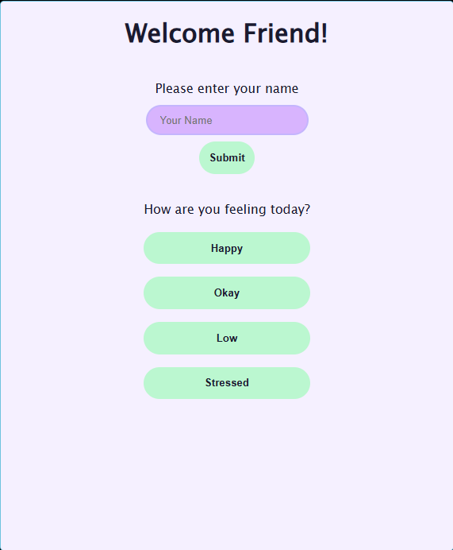
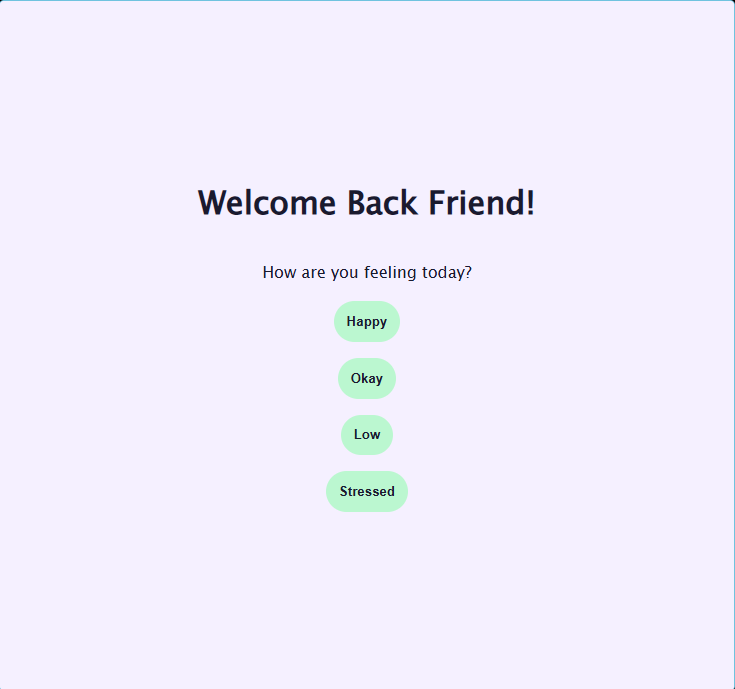
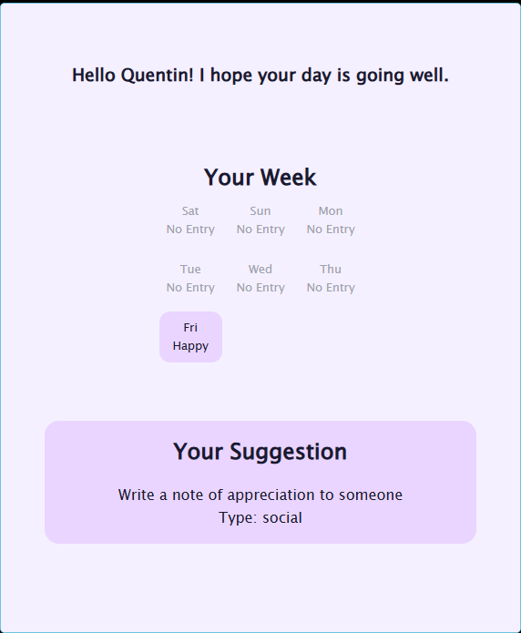
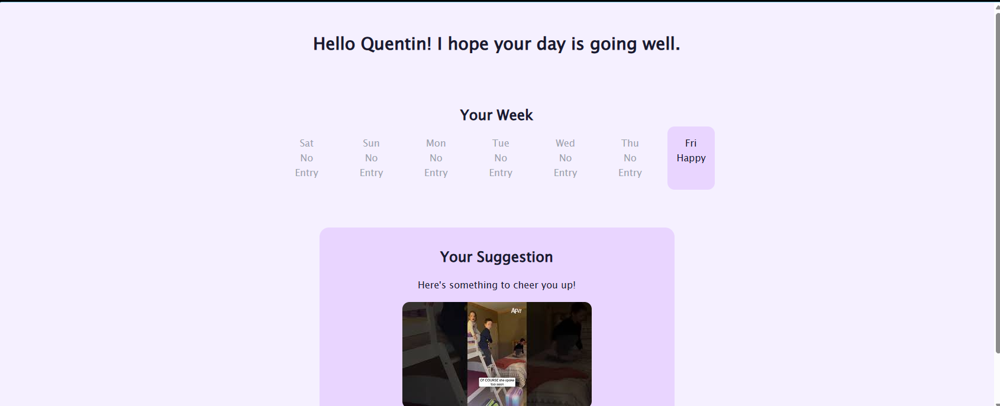
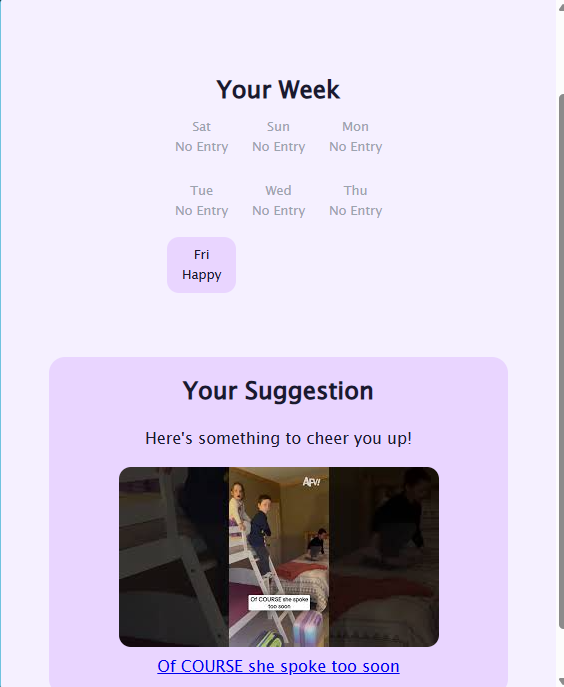

# 🌿 Mental Health Tracker

This app functions as a journal of sorts to help you keep track of your moods 
throughout the week. Depending on what you select as your mood, you will get a 
suggestion depending on that selection. From activities to funny Youtube videos. 

I built this app because mental health is very important to me. It gets overlooked 
and overshadowed by the day to day life we all live. But it is important to take 
care of you, so you can be the best you can be for yourself and for the people 
in your life.

## Features
- Enter your name and have it saved!
- Keeps track of the mood and the date the mood was entered.
- Suggests activities, quotes, or funny videos depending on the mood you select.
- If the user data gets deleted, the database will rebuild! Although, you will have to reenter your name and current mood!
- If the welcome page gets skipped, you will be redirected to either enter your name and mood, or just the mood depending on if you are a new or returning user.

## Tech Stack
- HTML 5
- CSS
- JavaScript
- Node.js
- Express.js
- YouTube Data API v3
- Bored API (appbrewery)
- Local JSON file storage

## How to Run

### Prerequisites
Before running this app you will need:
- [Node.js](https://nodejs.org) installed on your machine
- A YouTube Data v3 key from [Google Cloud Console](https://console.cloud.google.com)

### Installation
1. Clone the repository
- git clone https://github.com/quenskelia/mental-health-app
2. Navigate into the project folder
- cd mental-health-app
3. Install dependencies
- npm install
4. Create a `.env` file in the root of the project and add your YouTube API key: YOUTUBE_API_KEY=your-key-here
5. Start the server
- node server.js
6. Open your browser and go to: http://localhost:3000

## Screenshots

### Welcome Screen

### Dashboard 

